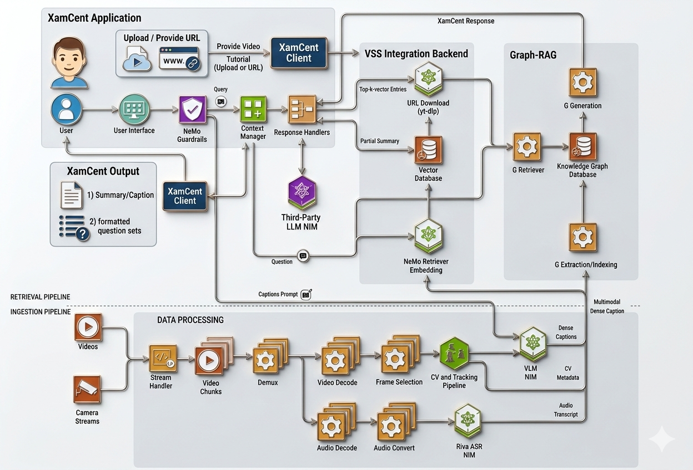

<h1 align="center">XamCent</h1>


<p align="center">
  <a href="#recipe">Recipe</a> |
  <a href="#working">Working</a> |
  <a href="#deployment-steps">Deployment Steps</a> |
  <a href="#file-structure">File Structure</a> |
  <a href="#future-work">Future Work</a> |
  <a href="#about">About</a>
</p>

<p align="center">
  
</p>


### The Recipe
XamCent is an interactive web-application built to leverage the power of video analytics and reasoning agents to generate question sets formatted adherent to global paper-setting standards, ready to be handed over to a class across any level of education, from kindergarten all the way to university. Using NVIDIA's [Video search and summarization (VSS) blueprint](https://docs.nvidia.com/vss/latest/index.html) and [Cosmos-Reason-2](https://docs.nvidia.com/cosmos/latest/reason2/index.html) with its video understanding capabilities, it captures key concepts taught from the input video tutorial or livestream and is able to generate an exam set with various question types, across three levels of difficulty. 

The question set can be formatted in line with internationally recognized entrance examinations such as:
1) Scholastic Aptitude Test (SAT) (intl.)
2) Joint Entrance Examination (JEE) (differing formats for "Main" and "Advanced" stages, held in South Asia) 
3) National Higher-Education Entrance Examination/Gao-Kao (held in China)
4) GCSE-A-Level Examination (held in the UK)
5) Graduate Record Examination (GRE) (intl.)
6) Graduate Management Admission Test (GMAT) (intl.)
7) Custom design (allowing a paper-setter to follow their local exam pattern)

### Working
XamCent connects to the VSS blueprint module over the backend, via port 8100. As illustrated in the following workflow:

<p align="center">
  
</p>

1) 📥 **Input Stage** — The user interacts with the XamCent UI and either provides a video file (.mp4,.mov,.avi accepted) or a URL to it, also including entire playlists (excluding those from YouTube owing to their access policy restrictions). This gets passed to the XamCent client which initializes two parallel pipelines.
2) ⚙️ **VSS Ingestion Pipeline** — The input video stream is split into manageable chunks and decoupled from the audio track. The [Cosmos-Reason-2-2B](https://huggingface.co/nvidia/Cosmos-Reason2-2B) parameter model analyzes the content shown throughout the video and generates dense video captions along with CV metadata (since the CV and tracking pipeline is also enabled). The separated audio stream is then processed using the [Riva Automatic Speech Recognition (ASR) NIM](https://build.nvidia.com/nvidia/parakeet-tdt-0_6b-v2) (also enabled) to convert essential descriptions and explanations offered by the tutor on a topic during the video, into easily interpretable transcripts. All three outputs — Dense Captions, CV Metadata, and Audio Transcript — feed upward as a Multimodal Dense Caption into the Graph-RAG system.
3) 🧠 **Retrieval Pipeline** — User queries are routed through a context manager and guardrails system, which retrieves semantically relevant video chunks from the vector and graph stores, passes them as grounded context to an LLM, and returns a summary and formatted question set to the user.
4) **Output** — Formatted Question Sets — structured, ready-to-hand-in exam questions derived from the actual video content


### Deployment Steps

1) Log in to NVIDIA Brev, find [this launchable](https://brev.nvidia.com/launchable/deploy/now?launchableID=env-2tYIjRXL4eMCbH9Az8mJC5WPAI4) and deploy the Crusoe 8 x L40S GPU instance that must run the blueprint. Please note the above link points to the GPU instance by Scaleway but the Crusoe VM configuration is recommended (and also the one used for XamCent-integration).
2) Once the VM is built and running, open an Ubuntu terminal. In the root dir:

```bash
brev login # Login to your Brev account
brev shell video-search-and-summarization-blueprint-1ee14a
# brev port-forward video-search-and-summarization-blueprint-1ee14a -p 9999:8888

```
3) Once inside the running instance, the video_search_and_summarization folder should already be found in its root dir. Clone this repository and move the modified jupyter notebook to /video-search-and-summarization/deploy/ (the same directory as the default notebook).

```bash
git clone https://github.com/subbubhat99/XamCent-Cosmos-Cookoff.git
cd XamCent-Cosmos-Cookoff
mv vss-xamcent-cookoff.ipynb ~/video-search-and-summarization/deploy/
```
4) Now navigate to the configuration file that the default notebook uses for launching all NIM's and the VIA server using docker compose.

```bash
cd video-search-and-summarization/deploy/docker/launchables/
nano config.yaml
```
and replace the ```caption ```, ```caption_summarization ```, and the ```summary_aggregation ``` variables under the ```prompts ``` tag with their respective descriptions as given in the configuration file from this directory. Feel free to replace it instead as well, given the only changes needed are in that section.

5) Follow the guide within the notebook by executing cells in the order provided.
6) Once you see the VIA VSS server started and has port 8100 exposed in the backend and the UI available at port 9100, open XamCent at https://xam-cent-question-generator--subbubhat99.replit.app/ and try it out with a video recording stored locally or a URL to a tutorial video (not from YouTube though!)  

#### Requirements
1) Check the following [prerequisites](https://docs.nvidia.com/vss/latest/content/vss_dep_docker_compose_x86.html#quickstart-docker) are met.
2) Install the brev-cli if not already.
**Note** - HF_TOKEN and NGC_API_KEY of the participant are offered in the notebook. 

### Future Work

### About

